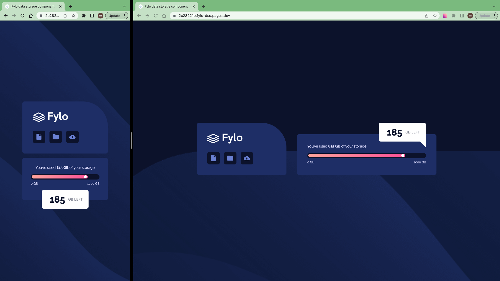

# Frontend Mentor - Fylo data storage component solution

This is a solution to the [Fylo data storage component challenge on Frontend Mentor](https://www.frontendmentor.io/challenges/fylo-data-storage-component-1dZPRbV5n)

## Table of contents

- [Overview](#overview)
  - [The challenge](#the-challenge)
  - [Screenshot](#screenshot)
  - [Links](#links)
- [My process](#my-process)
  - [Work time](#work-time)
  - [Built with](#built-with)
- [Author](#author)
- [Acknowledgments](#acknowledgments)

## Overview

### The challenge

Users should be able to:

- View the optimal layout for the site depending on their device's screen size

### Screenshot

### Links

- Solution: [frontendmentor.io](https://www.frontendmentor.io/solutions/fylo-data-storage-component-K8ZdFlQL6Y)

- Live Site: [cloudflare](https://2c28221b.fylo-dsc.pages.dev/)

## My process

- Prepare Project (Download assets, Install Vite, Install TailwindCss, Initialize git, Prepare project)
- Create components
- Publish

### Work Time

- [My Clockify Report](https://app.clockify.me/shared/647c989e94f4c64acaaf12f1)

### Built with

- React
- TailwindCss

## Author

- Frontend Mentor - [@siavhnz](https://www.frontendmentor.io/profile/siavhnz)

- github - [@siavhnz](https://www.github.com/siavhnz)

## Acknowledgments

Thanks To

[Frontendmentor.io](https://www.frontendmentor.io/challenges) - for their Excitement challenges  

[Perfect Pixel](https://chrome.google.com/webstore/detail/perfectpixel-by-welldonec/dkaagdgjmgdmbnecmcefdhjekcoceebi?hl=en) - for such a great extension